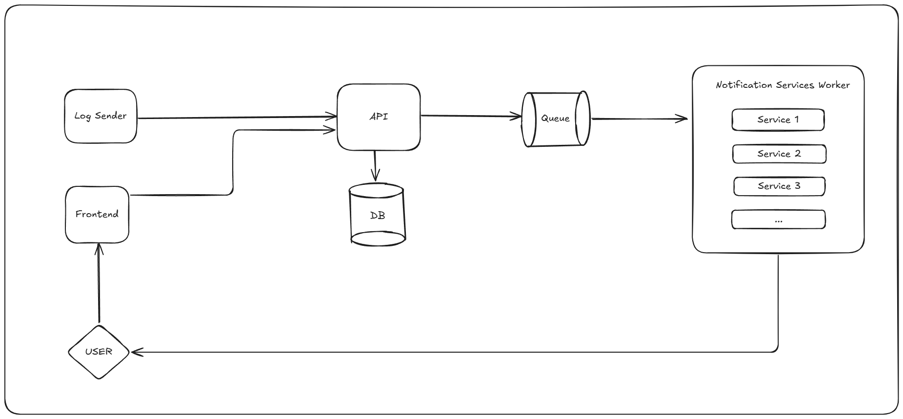
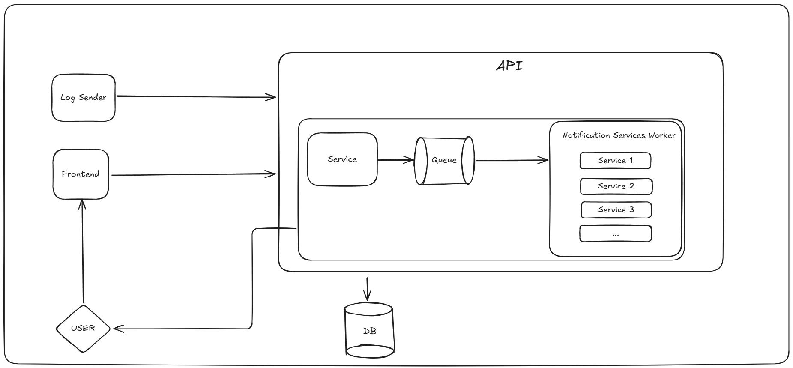
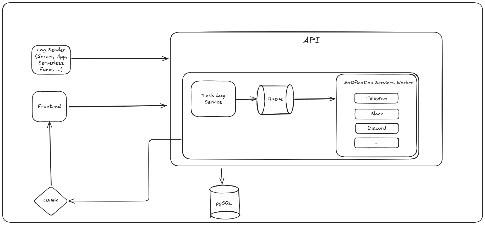
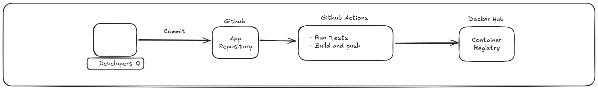
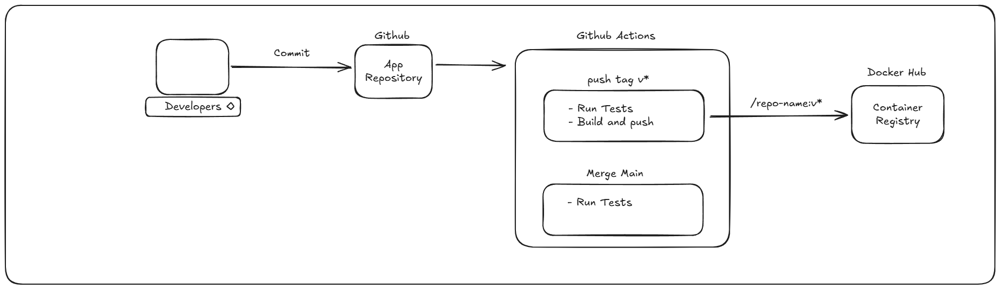
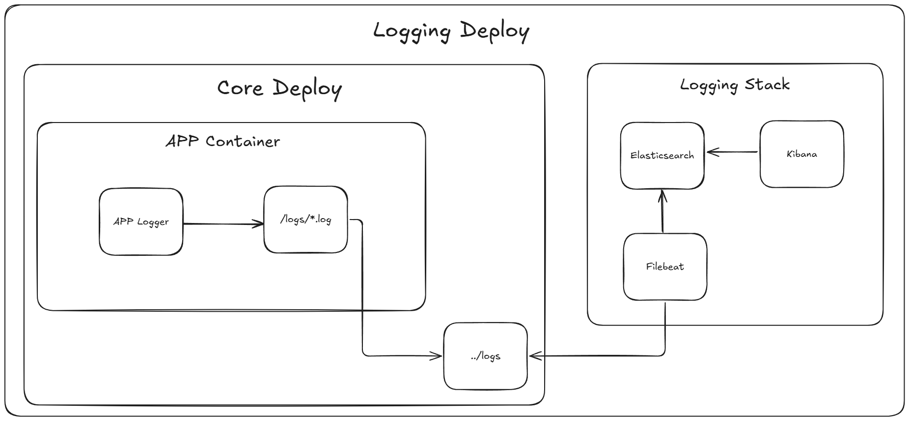
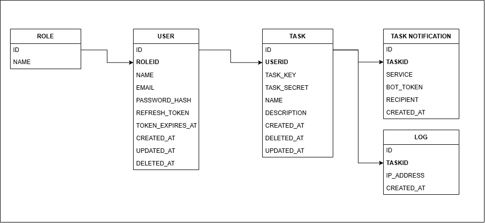

# Project Description

This project is a lightweight **task tracker and action logging service** that allows users to log specific task executions via a simple HTTP GET request.  
It is designed for easy integration with cron jobs, scripts, and other automated systems.

---

## Chapters

- [Project Description](#project-description)
- [How It Works](#how-it-works)
- [Example Use Cases](#example-use-cases)
- [System Design](#system-design)
- [Docker Image CI Pipeline via GitHub Actions](#docker-image-ci-pipeline-via-github-actions)
- [Docker-Based Unified Deployment Architecture](#docker-based-unified-deployment-architecture)
- [Database Diagram](#database-diagram)
- [API Reference (Swagger & Postman)](#api-reference-swagger--postman)

---

## How It Works

1. **Users define a task** via the API or system interface.  
   The system generates two random keys for each task:
   - `taskKey`: a randomly generated identifier used in the request URL
   - `taskSecret`: a secure random token used to verify authenticity

2. **The user triggers a GET request** after the desired action is completed.  
   Example format:

   ```
    GET /logs/:taskKey/:taskSecret
   ```

3. **The request is logged** in the system with:

- Timestamp  
- IP address  
- Task information

4. **If a notification service is integrated** (e.g., Telegram, Slack, Discord), a message is sent to the corresponding channel so the user is instantly notified of the task execution.

---

## Example Use Cases

### Cronjob Integration

Logs a scheduled task after it completes successfully.

```bash
0 3 * * * /path/to/backup.sh && curl https://example.com/logs/abc123/xyz789
```

### CI/CD Step Logging

Tracks deployments or individual pipeline steps in GitHub Actions, GitLab CI, etc.

```yaml
- name: Notify log service
  run: curl https://example.com/logs/deployStepKey/deploySecret
```

### Docker Healthcheck Integration

Lets you track container healthcheck pings over time.

```dockerfile
HEALTHCHECK CMD curl --silent --fail https://example.com/logs/healthcheck/abc123 || exit 1
```

---

### System Design

#### 1. System Design - High-Level Architecture



#### 2. System Design - Component-Level Design



#### 3. System Design - Technology Stack & Layered Architecture



---

### Docker Image CI Pipeline via GitHub Actions

This pipeline automates testing, building, and pushing the application Docker image to Docker Hub upon changes in the application repository. The configuration for this process is defined in [test-and-publish.yml](.github/workflows/test-and-publish.yml)

#### 1. CI Pipeline Overview (GitHub Actions)



#### 2. CI Pipeline – Conditional Workflow (Main vs Tag Push)



---

### Docker-Based Unified Deployment Architecture

This diagram presents the Docker-based deployment architecture of the project as a unified structure.
It includes the core components—such as the application and database—along with logging services like Elasticsearch, Filebeat, and Kibana.

All services are containerized and orchestrated using Docker Compose, providing a portable, isolated, and manageable deployment across development and production environments.
The Docker Compose configurations are defined in [/infra-configs/docker-compose.core.yml](/infra-configs/docker-compose.core.yml) and [/infra-configs/docker-compose.logging.yml](/infra-configs/docker-compose.logging.yml).
The related commands to manage these deployments can be found under the Infrastructure (infra-configs) Commands section in the project's [Makefile](/Makefile).

Image Location: [Docker Hub Repository](https://hub.docker.com/r/mhmet/task-tracker)



---

### Database Diagram



---

### API Reference (Swagger & Postman)

- Swagger UI: <http://localhost:3000/swagger/index.html> (Ensure the app is running locally to access this.)
- [Postman Workspace](https://www.postman.com/systemofadown/task-tracker/overview)
